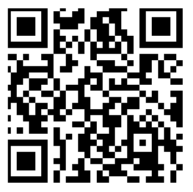

# Missing reporting
1. Grab your xlsx
2. Unzip it
3. Open `xl/worksheets/sheet1.xml` from unzipped folder
4. Beatify it (optional if you want to suffer :wink:)
5. Visualise table inside using `s` parameter of cell (e.g. 1 - black, 2-5 - white)
6. You got QR :sparkles:

Provided `script.py` can unzip xlsx, parse xml and generate qr as html table.  
`./script.py example.xlsx`

